# 2-Bo'lim

### 1-Dars. SELECT operatori.

Oldingi bo'limda biz MB, MBBT, SQL tili, MB yaratish, jadval yaratish kabi tushunchalar bilan tanishgan edik. Ikkinchi bo'limda esa asosiy so'rovlarni o'rganishni davom ettiramiz. Oldingi bo'limdan farqli ravishda, ushbu bo'limda so'rovlarni o'rganish uchun oldindan yaratilgan **northwind** MB-dan foydalanamiz.

Bu MB-ni ushbu [havola](./sources/northwind.sql)dan yuklab olib ishga tushirishingiz mumkin.

Jadvaldan kerakli ma'lumotlarni olish uchun `SELECT` operatoridan foydalaniladi. Asosiy sintaksisi quyidagicha:

```bash
SELECT ustun1, ustun2, ..., ustunN FROM jadval_nomi
```

Masalan:

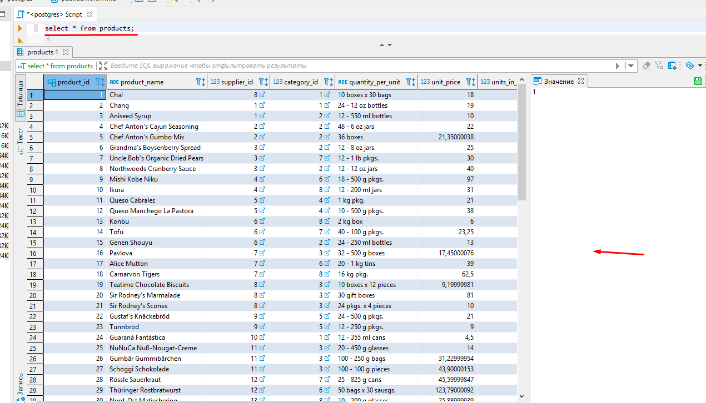

Misolda keltirilgan `*` barcha ustunlarni olishni anglatadi. Lekin doim ham `*` bilan ustunlar olinmaydi. Chunki ayrim hollarda barcha ustunlar ham kerak bo'lavermaydi. Hamma ustunni olish tizimga ortiqcha va keraksiz yuklanish tushirishi mumkin. Buning oldini olish uchun esa aynan kerak bo'ladigan ustunlar olinadi:

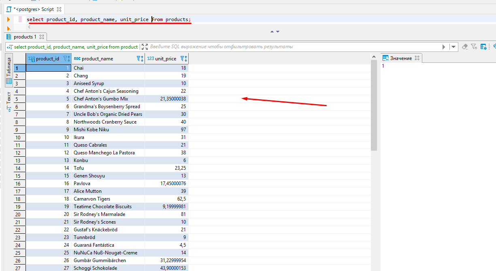

### 2-dars. Matematik amallar

SQL tili dasturlash tillari singari matematik amallarni bajarish imkonini beradi.

SQL tilidagi matematik amallar:

* `+` - qo'shish
* `-` - ayirish
* `*` - ko'paytirish
* `/` - bo'lish
* `^` - darajaga oshirish
* `|/` - kvadrat ildiz
* va boshqa ko'plab operator va funksiyalar

PostgreSQL-ning o'zida ham yana qo'shimcha matematik amallari mavjud.

Endi, amaliyotga o'tib, matematik amallarni bajarish ko'ramiz.

Ma'lumot sifatida test MB-dagi `products` jadvali ma'lumotlaridan foydalanamiz. `Products` jadvalida bitta mahsulot narxi (`unit_price`) va do'kondagi mahsulotlar soni (`unis_in_stock`) ustunlari mavjud. `Products` jadvalidagi mahsulotlar ro'yxatini chiqarishda, yangi ustunda mahsulotning umumiy narxini ham qo'shib chiqaraylik.

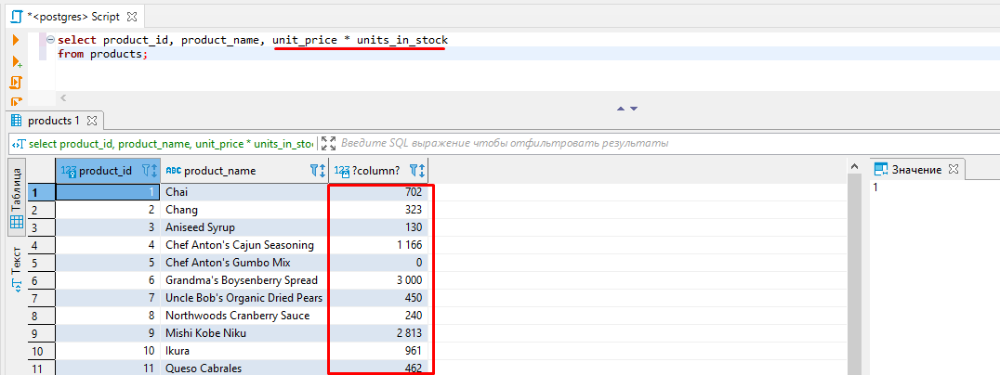

Ikkinchi misol, orders jadvalida buyurtmani yetkazib berishga qancha vaqt ketagnini hisoblaylik. PostgreSQL-da vaqt usti ham matematik amallarni bajarish mumkin. Shuning uchun yetkazib berishga ketgan vaqtni jo'natilgan vaqtdan yetkazil berilgan vaqtni ayirish orqali topib olamiz:

```bash
SELECT order_id, shipped_date - order_date FROM orders;
```

### 3-dars. DISTINCT

`DISTINCT` operatori jadvaldagi takrorlanmas (unique) ma'lumotlarni olib beradi. Misol uchun, test MB-dagi `employees` jadvalidan ishchilar yashaydigan shaharlarni olishimiz kerak bo'lsin (masalan, mana shu shaharlardan ishchilarimiz bor deb saytimizda ko'rsatmoqchimiz):

```bash
SELECT city FROM employees;
```

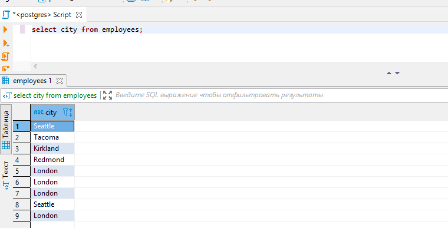

Lekin, ko'rib turganingizdek, ba'zi shaharlar takrorlanib chiqib qoldi (chunki, ayrim ishchilar bitta shahardan). Bizga esa, faqat bittasi yetarli. Duplikat (takrorlangan) shaharlarni qanday olib tashlash mumkin? Albatta, `DISTINCT` operatori bilan!

```bash
SELECT DISTINCT city FROM employees;
```

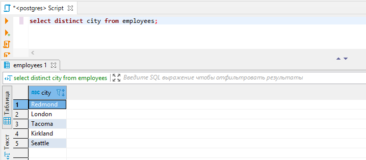

`DISTINCT` bilan nafaqat bitta, balki bir nechta ustunlarni ham ishlatish mumkin:

```bash
SELECT DISTINCT city, country FROM employees;
```

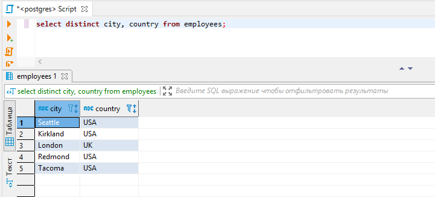

### 4-dars. COUNT

`COUNT` operatori qatorlar sonini hisoblab beradi. Masalan, `orders` jadvalida qancha yozuv borligini bilmoqchimiz:

```bash
SELECT COUNT(*) FROM orders;
```

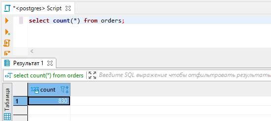

Bu yerda `COUNT(*)` dagi `*` o'rniga jadvaldagi birorta ustun nomini qo'shsa ham bo'ladi:

```bash
SELECT COUNT(id) FROM orders;
```

Endi, `employees` jadvalida nechta davlat borligini ko'raylik:

```bash
SELECT COUNT(id) FROM employees;
```

Lekin bu so'rov `employees` jadavalidagi davlatlar sonini emas, balki jadvaldagi barcha qatorlar sonini hisoblab beradi. Oldingi darsda ko'rganimizdek, davlatlar takrorlanib chiqqani sababli `COUNT` bizga no'to'g'ri ma'lumot chiqarib beradi. Nima qilish kerak? Albatta, `DISTINCT`-dan foydalanamiz!

```bash
SELECT COUNT(DISTINCT country) FROM employees;
```

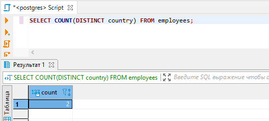


### 5-dars. WHERE

WHERE operatori bilan olinayotgan ma'lumotni biror ustun yoki ustunlar orqali filterlar olish mumkin. Aniqroq aytganda, olinadigan ma'lumotni biror shartga ko'ra chiqarib olish hisoblanadi.

Sintaksisi:

```bash
SELECT ustun1, ustun2, ..., ustunN FROM jadval_nomi WHERE shart;
```

Bu yerdagi shart **taqqoslash operatorlari** yordamida beriladi. Quyidagicha taqqoslash operatorlari bor:

* `=` - teng
* `>` - katta
* `>=` - katta yoki teng
* `<` - kichik
* `<=` - kichik yoki teng
* `<>` yoki `!=` - teng emas

Yuqoridagilarning barchasi `boolean` tipini beradi.

Quyidagi misolni ko'ramiz: `customers` jadvalidan hamma AQSh-dan bo'lgan buyurtmachilarni tanlab olaylik:

```bash
SELECT company_name, contact_name, phone  
FROM customers
where country = 'USA';
```

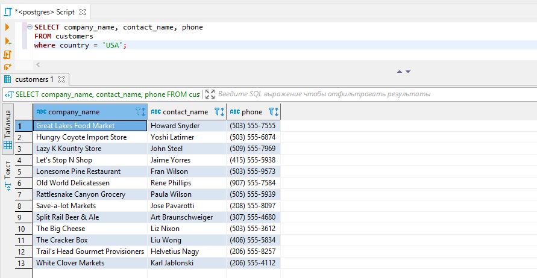

Yoki, `products` jadvalidan mahsulot narxi 50 dan katta bo'lgan mahsulotlar nechta ekanligini aniqlaylik:

```bash
SELECT COUNT(*)  
FROM products
where unit_price > 50;
```

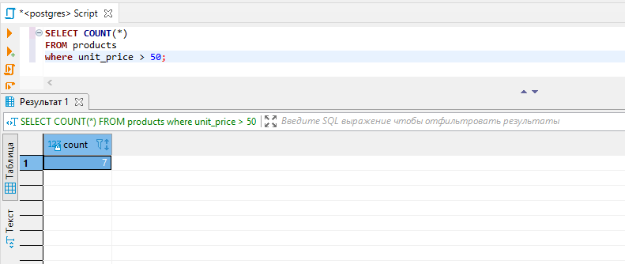

### 6-dars. AND, OR

Oldingi darsni davom ettiramiz. `WHERE` bilan filterlash paytida biz faqat bitta ustun bilan filterlayotgan edik. Lekin, agar bir nechta ustun bo'yicha filterlash kerak bo'lib qolsachi? Bu paytda `AND` va `OR` mantiqiy operatorlaridan foydalanamiz (`NOT` mantiqiy operatori ham bor. Uni keyinroq ko'ramiz).

Sintaksisi

```bash
SELECT ustun1, ustun2, ..., ustunN
FROM jadval_nomi
WHERE shart1 AND shart2 OR shart3 ...
```

`AND`-ning ishlashi. `AND` bilan shart berganda `AND` ning ikkala tomonidagi shart bir vaqtda bajarilishi kerak. Misol uchun, AQSh ning San Fransisko shtatidan bo'lgan buyurtmachilar kerak bo'lsa (ya'ni ham AQSh-dan bo'lishi kerak, ham AQSh-ning San Fransisko shtatida yashashi kerak) quyidagicha so'rov yozamiz:

```bash
SELECT * 
FROM customers 
WHERE country = 'USA' AND city = 'San Francisco';
```

`OR`-ning ishlashi. `OR` bilan shart berilganda `OR`-ning ikkala tomonidagi shartlardan bittasi bajarilsa ham filter ma'lumot qaytaradi. Masalan, `orders` jadvalidan Braziliya yoki O'zbekistondan bo'lgan buyurtmalarni saralab olaylik:

```bash
SELECT customer_id, ship_name, ship_country 
FROM orders
WHERE ship_country = 'Brazil' OR ship_country = 'Uzbekistan';
```

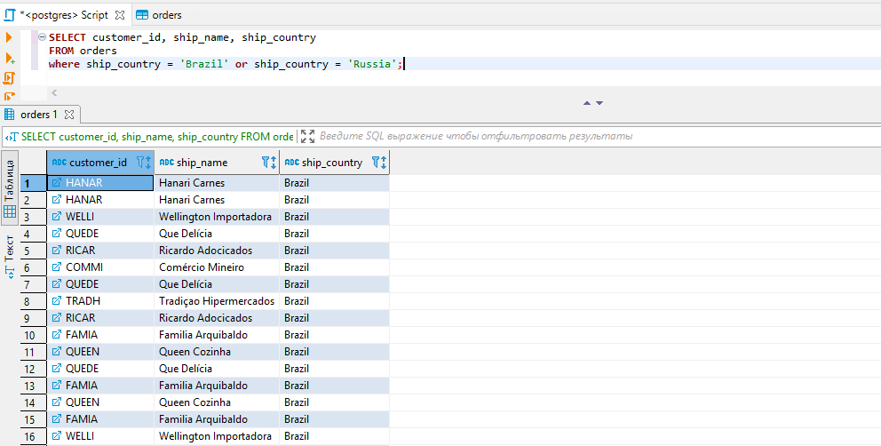

Natijadan ko'rinib turibdiki, bizga faqat Braziliyadan bo'lgan buyurtmalar chiqyapti. Chunki, O'zbekistondan hech qanday buyurtma bo'lmagan. Ya'ni, birinchi shart bajarilib ikkinchi shart bajarilmasa ham filter birinchi shartga tegishli ma'lumotlarni chiqarib beryapti. Bu yerda, agar ikkala tomondagi shart ham bajarilsa ikkala shart bo'yicha ham ma'lumotlarni chiqarib beradi.

Filterlashda, agar bir nechta shart ishlatilsa, ularning ayrimlarini **guruhlash** ham mumkin (**guruhlash qavs bilan amalga oshiriladi**). Guruhlaganda,  guruh ichidagi shartlar natijasi bitta shart sifatida olib ketiladi. Masalan:

```bash
SELECT * 
FROM orders
where shipped_date = '1998-04-30' and (freight > 75 or freight < 150);
```

Yuqoridagi so'rov bo'yicha, `orders` jadvalidan og'irligi 75  dan katta, 150 dan kichik va 1998-yil 30-apreldagi buyurtmalarni saralab olamiz. Bu so'rovda massani 75 va 150 orasida berish `OR` bilan bajarilyapti (ikkala shart bitta guruh qilib olingan) va ulardan qaytgan natija `AND` yordamida birinchi shart bilan birlashtirilyapti.

### 7-dars. BETWEEN

Bizga quyidagicha vazifa berildi: massasi 20 dan katta yoki teng va 40 dan kichik yoki teng bo'lgan buyurtmalarni olib berishimiz kerak. Bu vazifani `AND` operatori bilan bajarishimiz mumkin:

```bash
SELECT * 
FROM orders
WHERE freight >= 20 or freight <= 40;
```

Lekin bu vazifani `BETWEEN` operatori bilan bajarish mumkin. `BETWEEN` operatori intervalni bildiradi. Ingliz tilidan tarjima qilinganda `between` - orasida degani.

Yuqoridagi misolni `BETWEEN` bilan quyidagicha yozamiz:

```bash
SELECT * 
FROM orders
WHERE freight BETWEEN 20 and 40;
```

`BETWEEN` bilan oraliq aniqlanganda ikki tomondagi qiymat ham hisobga olinadi. Ya'ni, bizning misolda, oraliqqa 20 va 40 ham kiradi.
