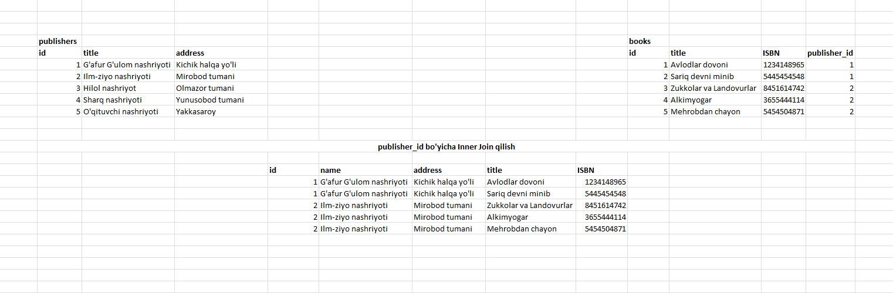
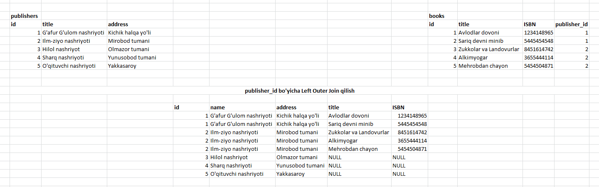
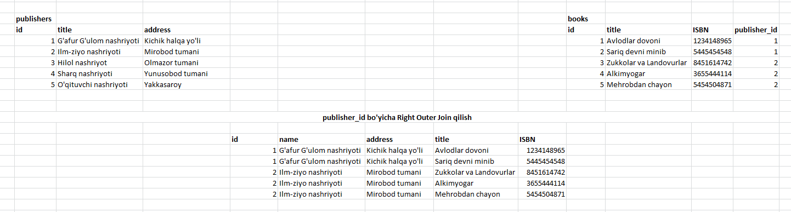
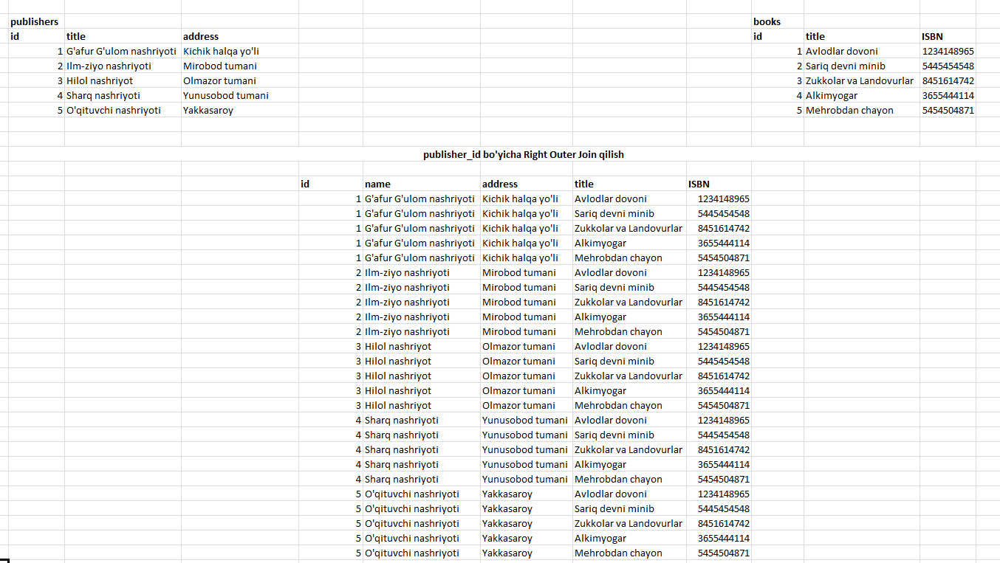

# 3-bo'lim

### 1-dars. Bog'lash

Oldingi darslarda faqatgina bitta jadval ustida ishlagan edik. Lekin, haqiqiy proyektlarda, bir nechta jadvallar ustida ham amallar bajariladi.

Bundan tashqari, birlamchi (primary key) va tashqi (foreign key)larni ham ko'rgan edik, ya'ni jadvallarni o'zaro bog'lashda maydonlar yaratgan edik. Bu bo'limimizda mana shu maydonlar orqali bir nechta jadvallarni bog'lashni ko'ramiz.

Jadvallarning bir nechta usuli mavjud:

* INNER JOIN - ichki bog'lash
* LEFT JOIN, RIGHT JOIN (yoki LEFT OUTER JOIN, RIGHT OUTER JOIN) - chap va o'ng bog'lanish
* FULL JOIN - to'liq bog'lanish
* CROSS JOIN - kesishmali bog'lanish
* SELF JOIN - o'ziga bog'lanish

JOIN-lar bilan ishlashdan oldin chap va o'ng jadvallar nima ekanligini tushunib olaylik. Ikkita jadvalni birlashtirishda, shartli ravishda, 1-jadvalni 2-jadval bilan birlashtiramiz deymiz. Shu yerda 1-jadval chap tomondagi jadval, 2-si o'ng tomondagi jadval deyiladi. Jadvallarning joylashishi muhim hisoblanadi.

INNER JOIN.

Bu yerdagi publishers jadvali chap tomon jadvali deyiladi (chunki u 1-bo'lib kelgan), books jadvali esa o'ng tomon jadvali deyiladi. Bu ikki jadval orasida INNER JOIN qo'llanilsa, chap tomondagi jadvalning faqatgina o'ng tomondagi jadvalning publisher_id maydoniga mos kelgan qatorlari olinadi (bunda chap tomondagi jadvalning har bir qatoriga unga mos keluvchi o'ng tomondagi jadval ma'lumotlari qo'shiladi). Misol uchun, tepadagi rasmga qarasak, Books jadvalidagi  1-qatorining publisher_id-si 1 ga teng, ya'ni, books jadvalining birinchi qatori publishers jadvalining 1-qatoriga bog'langan ma'lumot yangi jadvaldan joy olgan. Natijada, faqat books jadvalining publisher_id va publishers jadvalining id maydonlari bir xil bo'lgan ikkala jadval ma'lumotlari yangi jadvalda chiqadi.

LEFT OUTER JOIN.

Yuqoridagi rasmdan ko'rib turganingizdek, INNER JOIN-dan farqi, natijaviy jadvalda publishers jadvalidagi ma'lumotlarning books jadvalidagi publisher_id maydoni bilan mos kelmaganlari ham chiqyapti. Farqi, mos kelmagan publishers jadvali ma'lumotlarining books ma'lumolari chiqadigan qismi NULL bo'lib chiqyapti, ya'ni ma'lumot bo'sh. Haqiqatdan ham, publishers jadvalidagi 3-4-5-qatorlariga books jadvalidagi birorta qator bog'lanmagan. LEFT JOIN-ning INNER JOIN-dan farqi ham shunda. INNER JOIN faqat tashqi kalit bilan bog'langan ma'lumotlarni olib bersa, LEFT JOIN tashqi kalit bilan bog'langan maydonlardan tashqari, 1-jadvalning qolgan - bog'lanmagan ma'lumotlarni ham qo'shib chiqarib beradi.

RIGHT OUTER JOIN.

RIGHT OUTER JOIN ham xuddi LEFT OUTER JOIN-day ishlaydi. Farqi, RIGHT OUTER JOIN-da 2-jadvaldagi (bizning misolda books) bog'lanmagan ma'lumotlar qo'shib chiqariladi.

Berilgan misolda, natija xuddi INNER JOIN-dagi bilan bir xil chiqib qolgan. Chunki, books jadvalidagi barcha qatorlar publishers jadvaliga bog'langan.

CROSS JOIN.

Bu turdagi bog'lanish juda kam ham holatda ishlatiladi. Bu bog'lanishni keyinroq ko'rib chiqamiz. CROSS JOIN-da chap tomondagi jadvalning har bir qatorini o'ng tomondagi jadvalning har bir qatori bilan qo'shib chiqarib beradi.

Ko'rib turganingizdek, CROSS JOIN bizga doim ham kerak bo'lavermaydi.
