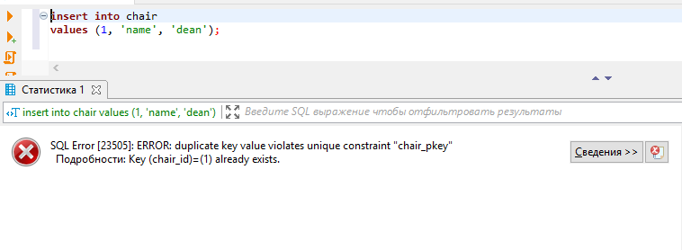
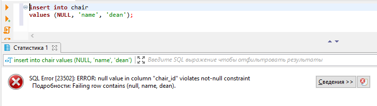
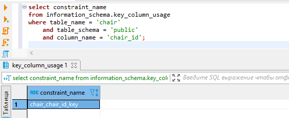

# 5-bo'lim

### 1-dars. DDL

**DDL - Data Defenition Language**. `DDL` - `SQL` tilining bir qismi bo'lib, u ma'lumotlarni yaratish, o'zgartirish va o'chirish kabi ishlarni bajarishda qo'llaniladi.

Bu darsda quyidagi tuzilmalarni o'rganamiz:

* **CREATE TABLE jadval_nomi** - jadval yaratish
* **ALTER TABLE jadval_nomi** - mavjud jadvalni o'zgartirish
  * **ADD COLUMN ustun_nomi malumot_tipi** - mavjud jadvalga ustun qo'shish
  * **RANAME TO jadvalning_yangi_nomi** - mavjud jadval nomini o'zgartirish
  * **RANAME ustunning_eski_nomi TO ustunning_yangi_nomi** - jadvaldagi ustun nomini o'zgartirish
  * **ALTER COLUMN ustun_nomi SET DATA TYPE malumot_tipi** - jadvaldagi ustun ma'lumotlarini o'zgartirish
* **DROP TABLE jadval_nomi** - jadvalni o'chirish
* **TRUNCATE TABLE jadval_nomi** - jadval ichidagi ma'lumotlarni tozalab tashalash. Bu yerda, agar jadvalda tashqi kalit (foreign key)li ustun mavjud bo'lsa, TRUNCATE jadvalni tozalay olmaydi.
* **DROP COLUMN ustun_nomi** - jadvaldagi ustunni o'chirish

**CREATE TABLE.**

Jadval yaratishni oldingi darslarda ko'rgan edik. Bu darsda ham misol ko'ramiz. *Talaba* va *kafedra* jadvallarini yaratamiz:

```bash
create table students
(
	student_id serial,
	first_name varchar,
	last_name varchar,
	birthday date,
	phone varchar
);

create table cathedra
(
	cathedra_id serial,
	cathedra_name varchar,
	dean varchar
);

create table faculty
(
	faculty_id serial,
	faculty_name varchar
); -- fakultetlarga ma'lumot kiritiladi. ma'lumot kiritishni keyingi darslarda ko'ramiz.
```

**ALTER TABLE.**

**ADD COLUMN.**

```bash
alter table students 
add column middle_name varchar;

alter table students 
add column rating float;

alter table students 
add column enrolled date;
```

**DROP COLUMN.**

```bash
alter table students 
drop column middle_name;
```

**RENAME TO.**

```bash
alter table cathedra 
rename to chair;
```

**RENAME ... TO**

```bash
alter table chair
rename cathedra_id to chair_id;

alter table chair
rename cathedra_name to chair_name;
```

**ALTER COLUMN**

```bash
alter table students 
alter column first_name set data type varchar(64);

alter table students
alter column last_name set data type varchar(64);

alter table students
alter column phone set data type varchar(30);
```

**TRUNCATE TABLE.**

```bash
truncate table faculty;
```

`TRUNCATE` bilan jadval tozalanganda,` serial` ketma-ketligini tozalamaydi. Shu sababli ham tozalangan jadvalga ma'lumot kiritilsa yangi `id`-lar oldingi kelib qolgan sondan boshlanib ketadi.

`id` qaytadan 1 bilan boshlanishi uchun, uni `RESTART` qilish kerak bo'ladi (odatiy holatda `CONTINUE` bo'lib tozalanadi):

```bash
truncate table faculty restart identity;
```

`truncate table faculty;` va `truncate table faculty continue identity;` so'rovlari bir xil amalni bajaradi.

**DROP TABLE.**

```bash
drop table faculty;
```

### 2-dars. PRIMARY KEY

**PRIMARY KEY** cheklovi jadvaldagi har bir yozuv (qator)ga takrorlanmas identifikatsiya berishda ishlatiladi.

> Primary key-lar UNIQUE qiymat qabul qilib, NULL qiymatiga ega bo'la olmaydi.

Shu bilan birga, jadvalda faqatgina bitta `PRIMARY KEY` bo'lishi mumkin. Bu `PRIMARY KEY` esa bir yoki bir nechta ustunlardan tashkil topgan bo'lishi mumkin.

Jadvalga `primary key` qo'shishni ko'raylik:

```bash
create table chair
(
	chair_id serial primary key,
	chair_name varchar,
	dean varchar
);
```

Endi jadvalga ma'lumot yozib ko'ramiz:

```bash
insert into chair (chair_name, dean)
values ('name', 'dean');
```

Bu yerda yangi yozuv jadvalga *1* `chair_id` bilan yoziladi. Agar, jadvalga yana *1* `chair_id`-li yangi yozuv qo'shmoqchi bo'lsak, tizim xatolik beradi:



Bundan tashqari, `chair_id`-ga `NULL` qiymat bersa ham xatolik beradi:




Chunki, `chair_id` `PRIMARY KEY` bilan e'lon qilingan.

Yuqorida `PRIMARY KEY` bilan jadval yaratish so'rovi quyidagi so'rov bilan deyarli bir xil:

```bash
create table chair
(
	chair_id serial unique not null,
	chair_name varchar, 
	dean varchar
);
```

Ularning farqi, jadvalda `PRIMARY KEY` faqatgina bitta bo'lishi mumkin bo'lsa, `UNIQUE NOT NULL` esa bir nechta bo'lishi mumkin.

`PRIMARY KEY`-dan foydalanishdan maqsad jadvalda tashqi kalit (`foreign key`)larni bog'lash hisoblanadi.

Umumiy qilib aytganda, odatda, `PRIMARY KEY`-dan jadvalda `UNIQUE` va `NOT NULL` bo'lgan, hamda `autoincrement` (qiymatni avto-oshishi) bo'lgan jadval identifikatsiyasini e'lon qilish uchun ishlatiladigan maydonga beriladi.

Barcha cheklovlarning o'zining nomi bo'ladi. Shu qatorda har bir jadvalga beriladigan `PRIMARY KEY`-ning ham nomi bor. Misol uchun yuqorida ochgan chair jadvalimizdagi `PRIMARY KEY` nomini olib ko'raylik:

```bash
select constraint_name
from information_schema.key_column_usage
where table_name = 'chair'
    and table_schema = 'public'
    and column_name = 'chair_id';
```



Demak chair jadvaliga `chair_chair_id_key` nomi berilgan. Agar, `PRIMARY KEY` nomini o'zimiz bermasak, buni tizimning o'zi amalga oshiradi.

Endi, `PRIMARY KEY`-ga nom berib e'lon qilaylik:

```bash
create table chair
(
	chair_id serial,
	chair_name varchar,
	dean varchar,

	constraint PK_chair_chair_id primary key (chair_id)
);
```

Jadvaldan `PRIMARY KEY` cheklovini o'chirib tashlash:

```bash
alter table chair
drop constraint chair_chair_id_key;
```

Jadvalga `PRIMARY KEY` o'rnatish:

```bash
alter table chair
add primary key (chair_id);
```
